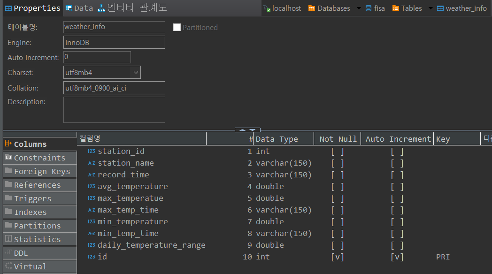
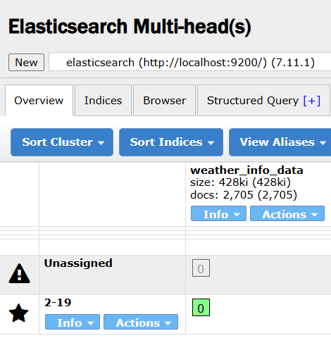
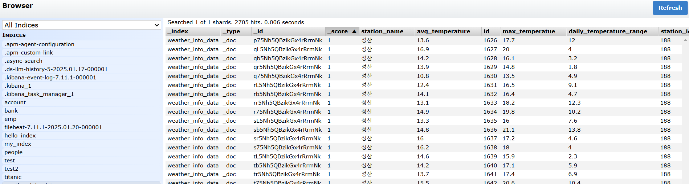

# weather data using Elastic stack


## 1. Team

👥 팀명 : 구구구칠

|||||
|:-:|:-:|:-:|:-:|
|김민성<br/>[@minsung159357](https://github.com/minsung159357)|SeulGi_LEE<br/>[@seulg2027](https://github.com/seulg2027)|HanJH<br/>[@letsgojh0810](https://github.com/letsgojh0810)|구민지<br/>[@user0830](https://github.com/user0830)|


## 2. Project intro & subject

💡 자기주도적 학습 기간 : `2025.01.19` ~ `2025.01.21`

💡 개요 : 데이터를

💡 주제 : 

💡 데이터 수집 : 


## 3. Stack and Tools

## 4. Database

<aside>

    📁 파일명

    1. [dataSet] weather_info.csv
    2. [logstash] weather_info.conf
    3. weather_info

</aside>

## 5. Practice course
### 5-1. 수집된 지역 별 기상 정보 데이터 합치기

- 메모장에서 데이터를 하나의 파일로 합치고 인코딩 UTF-8로 바꿔서 저장
- CSV파일 DBeaver로 Import하기



- PK로 설정할 수 있는 컬럼이 없어서 Auto Increment를 사용하는 id 컬럼을 추가하여 PK로 설정

### 5-2. Logstash에서 JDBC 연동

- config 파일 

```javascript
input {
  jdbc {
    jdbc_driver_library => "C:\02.devEnv\ELK\logstash-7.11.1\lib\mysql-connector-j-8.0.33.jar" # JDBC 드라이버 경로
    jdbc_driver_class => "com.mysql.cj.jdbc.Driver" # MySQL JDBC 드라이버 클래스
    jdbc_connection_string => "jdbc:mysql://localhost:3306/fisa" # MySQL 연결 문자열
    jdbc_user => "user01" # MySQL 사용자
    jdbc_password => "user01" # MySQL 비밀번호
    statement => "SELECT * FROM weather_info WHERE id > :sql_last_value" # 실행할 SQL 쿼리
    use_column_value => true
    tracking_column => "id" # 쿼리에서 변경된 데이터 추적
    tracking_column_type => "numeric"
    last_run_metadata_path => "C:\00.dataSet\03.9997\.logstash_jdbc_last_run" # 마지막 실행 시간 저장 경로
    schedule => "* * * * *" # 매 분 실행
  }
}

output {
  elasticsearch {
    hosts => ["http://localhost:9200"] # Elasticsearch 호스트
    index => "weather_info_data" # Elasticsearch 인덱스 이름
  }

  stdout { codec => rubydebug } # 디버깅용 출력
}  
```

### 5-3. logstash 실행

- elastic search 실행 후 logstash 실행
```bash
logstash -f ..\config\weather_info.conf
```

- 정상적으로 SELECT를 하는지, 1분을 주기로 다시 SEELCT 하는지 확인





- DB에 3개의 값을 추가하고 1분 후 중복되지 않은 값인 id값이 추가됨을 logstash에서 인식하고 2702개였던 데이터가 2705개로 정상적으로 추가됨

### 5-4. 

## 6. Trouble Shooting
# 파일명 오류
logstash 와 jdbc 를 연동하는 설정파일(mysql-logstash.conf) 수정 중 파일명을 잘못 기재하여 오류발생.


mysql-connector-java-8.0.32.jar --->mysql-connector-j-8.0.33.jar 수정완료.


# jdbc 연결 오류


조건없이 전체 데이터를 조회하는 과정 중 tracking_column 값을 주석처리하여 오류 발생. 


use_column_value = false 값으로 변경하여 해결.


## 7. Review
