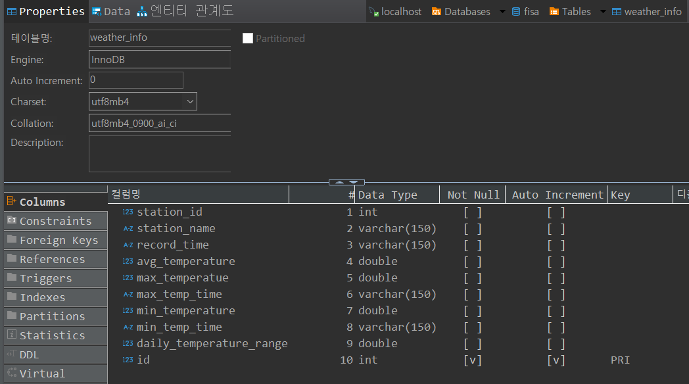
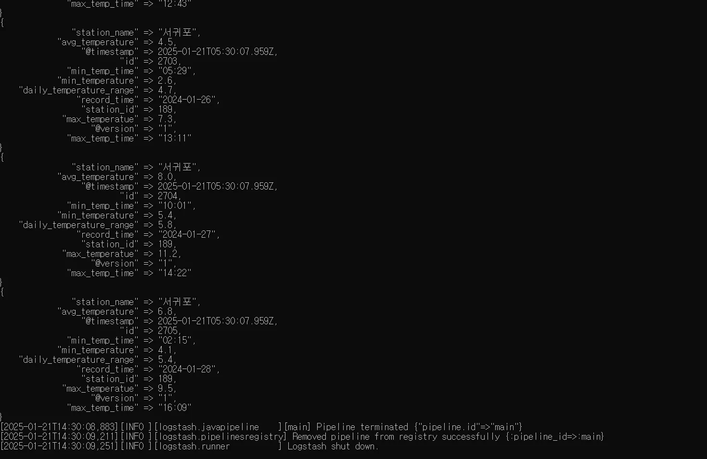
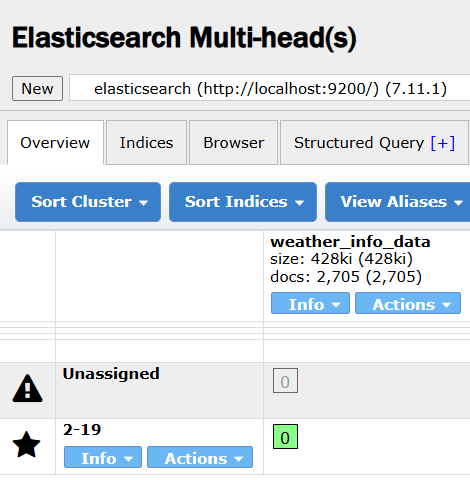
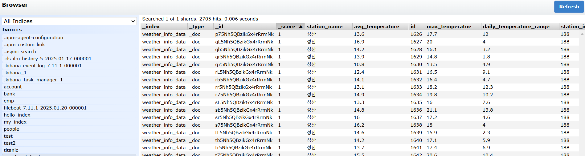
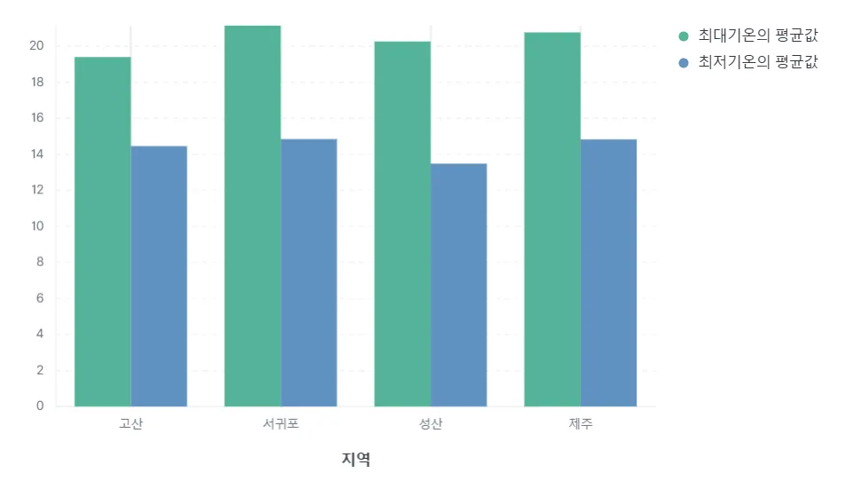
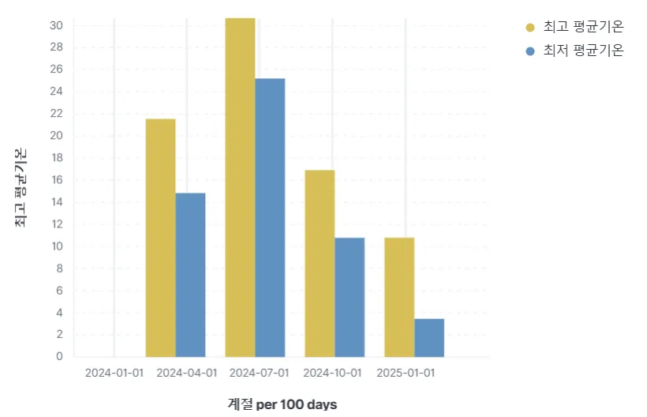

# ☀️ Automating Weather Data with Elastic Stack Using JDBC

## 목차
1. [Team](#1-team)
2. [Project intro & subject](#2-project-intro--subject)
3. [Stack and Tools](#3-stack-and-tools)
4. [Database](#4-database)
   - [weather_info table](#weather_info-table)
   - [DDL](#-ddl)
   - [DML](#%EF%B8%8F-dml)
5. [Hands On](#5-hands-on)
   - [5-1. 수집된 지역 별 기상 정보 데이터 합치기](#5-1-수집된-지역-별-기상-정보-데이터-합치기)
   - [5-2. Logstash에서 JDBC 연동](#5-2-logstash에서-jdbc-연동)
   - [5-3. logstash 실행](#5-3-logstash-실행)
   - [5-4. Kibana 시각화](#5-4-kibana-시각화)
6. [Trouble Shooting](#6-trouble-shooting)
7. [Review](#7-review)

## 1. Team

👥 팀명 : 구구구칠

|||||
|:-:|:-:|:-:|:-:|
|김민성<br/>[@minsung159357](https://github.com/minsung159357)|SeulGi_LEE<br/>[@seulg2027](https://github.com/seulg2027)|HanJH<br/>[@letsgojh0810](https://github.com/letsgojh0810)|구민지<br/>[@minjee83](https://github.com/minjee83)|


## 2. Project intro & subject

💡 자기주도적 학습 기간 : `2025.01.19` ~ `2025.01.21`

💡 개요 : 본 프로젝트는 Filebeat를 사용하지 않고 `Logstash`와 `JDBC`를 직접 연결해 Pipeline을 구축하여 **MySQL 데이터를 자동 수집하는 프로그램을 구현**하는 데 초점을 맞췄다. 이를 통해 Elastic Stack의 핵심 구성 요소에 대한 이해를 심화하고, 데이터의 자동 수집 및 분석 프로세스를 효과적으로 구축하는 방법론을 학습하고자 한다.

💡 주제 : 기온 데이터를 바탕으로 제주도의 4개 지역의 날씨 분석

💡 데이터 수집 : [기상청의 기온 데이터](https://data.kma.go.kr/climate/RankState/selectRankStatisticsDivisionList.do)를 csv로 저장해, mysql에 저장하였다.


## 3. Stack and Tools

| 기술           | 설명                         |
|----------------|------------------------------|
|     | 데이터 검색 및 분석 엔진      |
|       | 데이터 수집 및 처리 도구      |
|    | 관계형 데이터베이스 관리 시스템 |
|           | Java 데이터베이스 연결 API     |
|         | 데이터 시각화 및 대시보드 도구 |


## 4. Database

<aside>

    📁 파일명

    1. [dataSet] weather_info.csv
    2. [logstash] mysql-logstash.conf
    3. mysql-connector-j-8.0.33.jar

</aside>


## `weather_info` table


| **컬럼명**                | **설명**                                                                                   |
|-------------------------|--------------------------------------------------------------------------------------------|
| `station_id`             | 기상 관측소의 고유 번호 (정수형)                                                               |
| `station_name`           | 기상 관측소의 이름 (문자열형, 최대 150자)                                                       |
| `record_time`            | 기상 데이터를 기록한 날짜 및 시간 (문자열형, 예: "2024-01-01")                                 |
| `avg_temperature`        | 해당 날짜의 평균 기온 (실수형, 섭씨 기준)                                                      |
| `max_temperatue`         | 해당 날짜의 최고 기온 (실수형, 섭씨 기준)                                                      |
| `max_temp_time`          | 최고 기온이 발생한 시간 (문자열형, 예: "12:44")                                                |
| `min_temperature`        | 해당 날짜의 최저 기온 (실수형, 섭씨 기준)                                                      |
| `min_temp_time`          | 최저 기온이 발생한 시간 (문자열형, 예: "07:59")                                                |
| `daily_temperature_range`| 해당 날짜의 일교차 (실수형, 최고 기온과 최저 기온의 차이, 섭씨 기준)                               |
| `id`                     | 각 데이터 레코드의 고유 식별자 (자동 증가하는 정수형)                                           |


## 📌 DDL

CSV 데이터 파일 형식에 맞추어 날씨 데이터 DDL문을 작성

```sql
CREATE TABLE TemperatureData (
    id INT PRIMARY KEY AUTO_INCREMENT,     -- 아이디
    station_id INT NOT NULL,               -- 지점번호
    station_name VARCHAR(100) NOT NULL,    -- 지점명
    record_time DATETIME NOT NULL,         -- 일시
    avg_temperature FLOAT,                 -- 평균기온
    max_temperature FLOAT,                 -- 최고기온
    max_temp_time TIME,                    -- 최고기온시각
    min_temperature FLOAT,                 -- 최저기온
    min_temp_time TIME,                    -- 최저기온시각
    daily_temperature_range FLOAT,         -- 일교차
    PRIMARY KEY (id)
);
```
## ✏️ DML

프로그램의 자동화를 테스트하기 위해 추가적인 더미데이터를 DML문으로 생성

```sql
INSERT INTO weather_info (
	station_id,
	station_name,
	record_time,
	avg_temperature,
	max_temperatue,
	max_temp_time,
	min_temperature,
	min_temp_time,
	daily_temperature_range
)
VALUES
(189, '서귀포', '2024-01-26', 4.5, 7.3, '13:11', 2.6, '05:29', 4.7),
(189, '서귀포', '2024-01-27', 8.0, 11.2, '14:22', 5.4, '10:01', 5.8),
(189, '서귀포', '2024-01-28', 6.8, 9.5, '16:09', 4.1, '02:15', 5.4);
```
---

### 1. 📈 [dataSet]

기상청 자료개방포털에서 **제주도** 기온 데이터를 가져와 데이터 정제 후 사용


</br>


출처 : 기상청

[기상자료개방포털](https://data.kma.go.kr/cmmn/main.do)


### 2. 📄 [logstash] weather_info.conf
#### logstash.conf 파일 설정
- jdbc driver 와 연동

```conf
input {
  jdbc {
    jdbc_driver_library => "C:\02.devEnv\ELK\logstash-7.11.1\lib\mysql-connector-j-8.0.33.jar" # JDBC 드라이버 경로
    jdbc_driver_class => "com.mysql.cj.jdbc.Driver" # MySQL JDBC 드라이버 클래스
    jdbc_connection_string => "jdbc:mysql://192.168.1.10:3306/fisa" # MySQL 연결 문자열
    jdbc_user => "user01" # MySQL 사용자
    jdbc_password => "user01" # MySQL 비밀번호
    statement => "SELECT * FROM weather_info WHERE id > :sql_last_value" # 실행할 SQL 쿼리
    use_column_value => true
    tracking_column => "id" # 쿼리에서 변경된 데이터 추적
    tracking_column_type => "numeric"
    last_run_metadata_path => "C:\00.dataSet\03.9997\.logstash_jdbc_last_run" # 마지막 실행 시간 저장 경로
    schedule => "* * * * *" # 매 분 실행
  }
}

output {
  elasticsearch {
    hosts => ["http://localhost:9200"] # Elasticsearch 호스트
    index => "weather_info_data" # Elasticsearch 인덱스 이름
  }

  stdout { codec => rubydebug } # 디버깅용 출력
}
```


### 3. 📁 weather_info
elasticsearch-head에서 정상 업로드 확인


---

## 5. Hands On
### 5-1. 수집된 지역 별 기상 정보 데이터 합치기

- 메모장에서 데이터를 하나의 파일로 합치고, 파일이 기본 `ANSI` 로 설정되어 있어서 인코딩 `UTF-8`로 바꿔서 저장
- CSV파일 DBeaver로 Import하기



- PK로 설정할 수 있는 컬럼이 없어서 Auto Increment를 사용하는 id 컬럼을 추가하여 PK로 설정
- 이미 데이터가 저장된 테이블에 Auto Increment Column을 추가하는 것이므로, 강제로 데이터 넣어서 저장

```sql
SET @row_num = 0;

UPDATE weather_info
SET id = (@row_num := @row_num + 1);
```

### 5-2. Logstash에서 JDBC 연동

- config 파일 

```javascript
input {
  jdbc {
    jdbc_driver_library => "C:\02.devEnv\ELK\logstash-7.11.1\lib\mysql-connector-j-8.0.33.jar" # JDBC 드라이버 경로
    jdbc_driver_class => "com.mysql.cj.jdbc.Driver" # MySQL JDBC 드라이버 클래스
    jdbc_connection_string => "jdbc:mysql://localhost:3306/fisa" # MySQL 연결 문자열
    jdbc_user => "user01" # MySQL 사용자
    jdbc_password => "user01" # MySQL 비밀번호
    statement => "SELECT * FROM weather_info WHERE id > :sql_last_value" # 실행할 SQL 쿼리
    use_column_value => true
    tracking_column => "id" # 쿼리에서 변경된 데이터 추적
    tracking_column_type => "numeric"
    last_run_metadata_path => "C:\00.dataSet\03.9997\.logstash_jdbc_last_run" # 마지막 실행 시간 저장 경로
    schedule => "* * * * *" # 매 분 실행
  }
}

output {
  elasticsearch {
    hosts => ["http://localhost:9200"] # Elasticsearch 호스트
    index => "weather_info_data" # Elasticsearch 인덱스 이름
  }

  stdout { codec => rubydebug } # 디버깅용 출력
}  
```

### 5-3. logstash 실행

- elastic search 실행 후 logstash 실행
```bash
logstash -f ..\config\weather_info.conf
```

- 정상적으로 SELECT를 하는지, 1분을 주기로 다시 SEELCT 하는지 확인





- DB에 3개의 값을 추가하고 1분 후 중복되지 않은 값인 id값이 추가됨을 logstash에서 인식하고 2702개였던 데이터가 2705개로 정상적으로 추가됨

### 5-4. Kibana 시각화


- Kibana에서 Data Visualize

|        |           |
|-------------------|-------------------|
|  |  | 
| 월 평균 기온             | 연 평균 일교차             |

|        |           |
|-------------------|-------------------|
|  |  |
| 지역 별 최대/최소 기온            | 계절 별 최대/최소 기온             |


## 6. Trouble Shooting
### 파일명 오류
logstash 와 jdbc 를 연동하는 설정파일(mysql-logstash.conf) 수정 중 파일명을 잘못 기재하여 오류발생.


mysql-connector-java-8.0.32.jar --->mysql-connector-j-8.0.33.jar 수정완료.


### jdbc 연결 오류


조건없이 전체 데이터를 조회하는 과정 중 `tracking_column` 값을 주석처리하여 오류 발생.


✔ 이유 : `use_column_value` 값이 true 인 경우, logstash는 `tracking_column` 값을 기준으로 데이터를 수용하기 때문

use_column_value = false 값으로 변경하여 해결.


### AUTO_INCREMENT 오류

PRIMARY KEY 를 먼저 설정하지 않은채로 AUTO_INCREMENT 설정을 하여 오류발생.


PRIMARY KEY 를 먼저 설정하여 해결.


## 7. Review

<details>
<summary>이슬기</summary>

[배운 점]
프로젝트를 통해 logstash의 conf 파일을 커스터마이징을 하는 방법을 배웠고, JDBC 드라이버와 연결하는 방법을 배웠다. 또한, Pipeline을 구축하며 실행되지 않는 다양한 문제에 직면하면서 logstash가 어떻게 동작하는지 배울 수 있었다.😄

[아쉬운 점]
mysql부터 Elasticsearch는 logstash를 사용해 데이터 전송을 자동화할 수 있었지만, mysql에 데이터를 적재하는 로직을 API 혹은 크롤링을 통해 자동화 프로그램을 만들 수 있었다면 더욱 좋았을 것 같다.

[앞으로..]
프로세스를 더욱 최적화할 수 있는 부분은 없는지 고민하고, 실습을 진행해보아야겠다.
</details>

<details>
<summary>한정현</summary>

[배운 점]
CSV파일만 읽어와서 정적인 데이터로만 logstash를 사용했었는데 이번 기회를 통해 jdbc 설정으로 DB에 연결하여 동적인 데이터를 다루는 법을 배우는 기회가 되어 좋았다. elastic search에 대해 좀 더 깊게 학습하게 된 것 같아서 유익한 시간이었다.

[아쉬운 점]
직접 DB에 insert를 하지 않고 API를 사용하여 실시간으로 바뀌고 추가되는 데이터들을 만들어보지 못해서 아쉬웠다.

[앞으로..]
jdbc의 여러 설정들에 대해 학습하고 실시간으로 바뀌는 데이터들을 사용해서 만들어보고 싶다.
</details>

<details>
<summary>구민지</summary>

[배운 점]
MySQL과 Logstash를 JDBC 드라이버를 통해 연결하여 데이터 파이프라인을 구축하는 과정을 직접 경험함으로써, Logstash의 데이터 처리 흐름과 작동 원리를 보다 명확히 이해할 수 있었다.
데이터 수집, 변환, 저장의 전 과정을 설계하고 구현함으로써 Elastic Stack의 주요 구성 요소들에 대한 실질적인 활용법을 익혔다.

[아쉬운 점]
연결 설정 과정에서 로컬 파일을 실수로 삭제하는 일이 발생했으며, 이로 인해 백업과 파일 관리의 중요성을 절실히 느꼈다. 
프로젝트 진행 중에는 항상 데이터 손실에 대비하는 습관을 길러야 함을 깨달았다.
    
[앞으로..]
모든 작업 파일을 체계적으로 정리하고, Git 또는 클라우드 백업 서비스를 적극적으로 활용하여 데이터 손실을 방지해야겠다.
이번 프로젝트에서는 정적 데이터를 활용했으나, 다음 프로젝트에서는 실시간 스트리밍 데이터를 Logstash와 Elastic Stack으로 처리하는 방식을 시도해 보고 싶다.

</details>

<details>
<summary>김민성</summary>

[배운 점]
logstash 와 jdbc 를 연동하는 방법과 브릿지가 아닌 포트포워딩을 통해 공용 db 를 만들어 접속하는 방법을 배웠다. 데이터를 먼저 넣고 Alter Table 을 통해 제약조건을 설정할때 primary key 를 우선적으로 해줘야 한다는 것을 깨달았다.

[아쉬운 점]
새롭게 추가 할 데이터를 자동화하지 못하고 db에 수동으로 기입한 것이 아쉬웠다.

[앞으로..]
데이터 추가기능을 자동화 해보고싶다.

</details>
